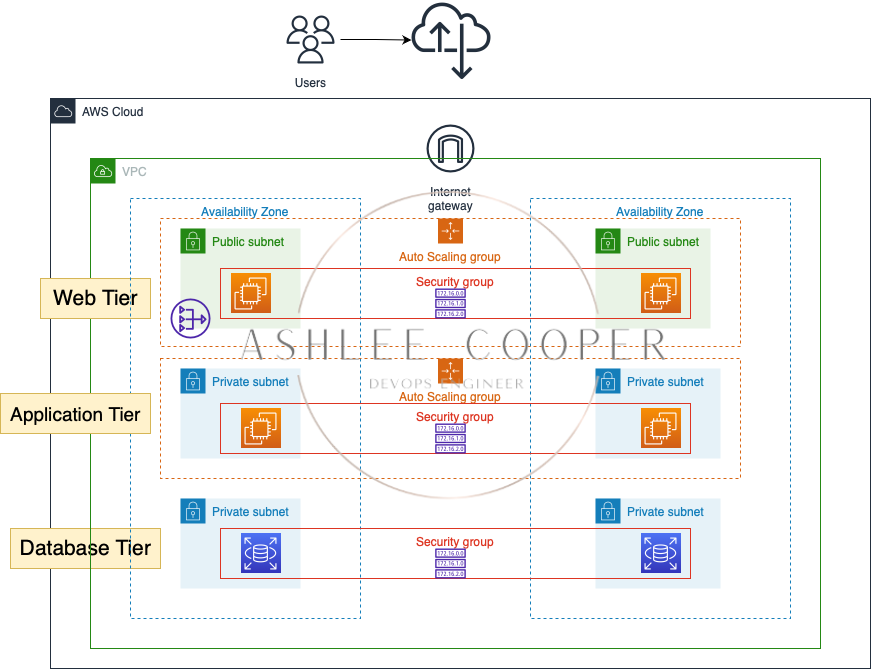

# terraform-aws-infra

Implementation of a 3 tier architecture in AWS with Terraform

- Presentation Tier: This is the topmost level of the application responsible
  for collecting the information. It provides user interface and handles the
  interaction with the user, it sends content to browsers in the form of
  HTML/JS/CSS, and it communicates with other tiers by which it provides the
  results to the browser/client side.
- Logic Tier: Also known as the application tier. This contains a set of
  rules for processing information, business logic and able to accommodate many
  users. Sometimes also called as middleware. It processes the inputs received
  from the clients and interacts with the database and runs on a web server.

- Data Tier: A database, comprising both data sets and the database
  management system or RDBMS software that manages and provides access to the
  data (back-end). It provides security, data integrity and support to the
  application.

## 

## References

- https://aws.plainenglish.io/3-tier-architecture-in-aws-e410d610ed74
